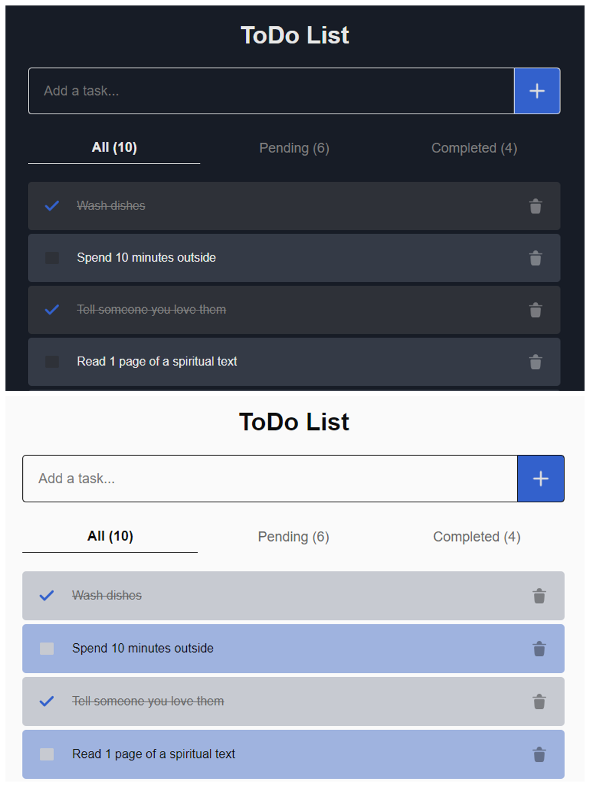

# ReactJS Todo List App

A simple and responsive todo list application built with React.js. This app helps users manage tasks efficiently by allowing them to add, delete, and mark tasks as complete. The intuitive interface ensures a smooth experience across devices.

## Screenshot

  <!-- Replace with the path to your screenshot image -->

## Live Demo

You can try out the live demo of this project [here](https://reactjs-app-todo-list.vercel.app/).

## Features

- **Add Tasks**: Quickly add new tasks with a simple input form.
- **Delete Tasks**: Remove tasks that are no longer needed.
- **Mark as Complete**: Mark tasks as completed with a single click.
- **Local Storage**: Tasks are saved in local storage to retain your list between sessions.
- **Redux Toolkit**: Using Redux store to manage the task list more efficiently.
- **Responsive Design**: Works seamlessly on desktop and mobile devices.

## Installation

### Using Create React App

To get started with the project locally using Create React App, follow these steps:

1. **Clone the repository:**

    ```bash
    git clone https://github.com/EthanEDev/reactjs-app-todo-list.git
    ```

2. **Navigate to the project directory:**

    ```bash
    cd reactjs-app-todo-list
    ```

3. **Install dependencies:**

    ```bash
    npm install
    ```

4. **Start the development server:**

    ```bash
    npm start
    ```

### Using Vite

If the project uses Vite instead of Create React App, follow these steps:

1. **Clone the repository:**

    ```bash
    git clone https://github.com/EthanEDev/reactjs-app-todo-list.git
    ```

2. **Navigate to the project directory:**

    ```bash
    cd reactjs-app-todo-list
    ```

3. **Install dependencies:**

    ```bash
    npm install
    ```

4. **Start the development server:**

    ```bash
    npm run dev
    ```

## Usage

Once the application is running, you can manage your tasks by:

- **Adding Tasks**: Enter the task name and click the "Add" button to add a new task to the list.
- **Deleting Tasks**: Remove a task by clicking the delete button.
- **Marking Tasks as Complete**: Click the checkbox next to a task to mark it as completed.
- **Persistent Task List**: Tasks are stored in local storage, so your list is retained even after refreshing or closing the browser.

## Technologies Used

- React.js
- JavaScript (ES6+)
- CSS
- SCSS
- Redux Toolkit
- Local Storage

## Contributing

Contributions are welcome! If you have suggestions for improvements or find bugs, please open an issue or submit a pull request.

1. Fork the repository.
2. Create a new branch (`git checkout -b feature-branch`).
3. Commit your changes (`git commit -am 'Add new feature'`).
4. Push to the branch (`git push origin feature-branch`).
5. Create a new Pull Request.

## License

This project is licensed under the MIT License - see the [LICENSE](LICENSE) file for details.

## Contact

If you have any questions, feel free to reach out to me via GitHub issues or at [ethan.ekhtiyar@gmail.com](mailto:ethan.ekhtiyar@gmail.com).
